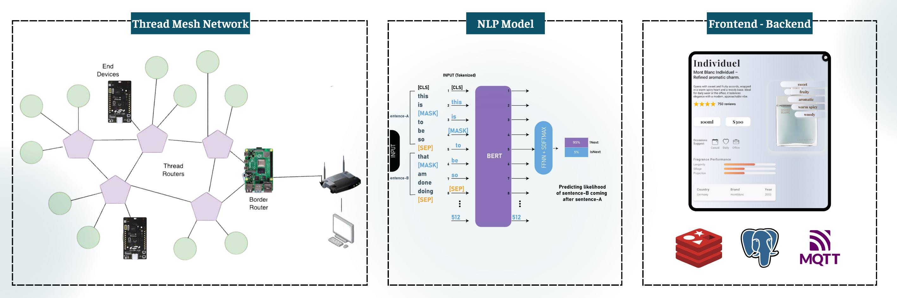

# 🌐 Raspberry Pi 4 - Local S.C.E.N.T Shelf Openthread Border Router & Embedded PC


## 📖 Overview
<p align="center">
  
</p>

- **It acts both as an OpenThread Border Router and as the central processing unit, handling and relaying communication between the Silabs microcontrollers and the server over a local LAN network.**

---

## ✨ Key Technologies
- 🌐 **OpenThread Border Router:** Acts as the **Leader** of a Thread network on the shelf, paired with an **RCP - EFR32MG21 USB Stick**, and connects with child nodes (Silabs microcontrollers).  
- 💻 **Frontend:** Provides an interactive interface for customers through an **LCD Tablet** directly on the shelf.  
- ⚙️ **Backend:** Handles database polling and backend logic, exchanging data via **Redis / UART / UDP Thread

---


## 🖥️ Build Environment Setup


### Linux ( Raspberry Pi 4)
1. Update hệ thống: `sudo apt update && sudo apt upgrade`  
2. Cài Python ≥3.9, pip, Git, Redis  
3. Clone repo và build firmware bằng `make all`  
4. Cài đặt PostgreSQL
5. Cài đặt Redis  

---

### Start Running
1. Install OTBR (OpenThread Border Router) or use the provided container.
2. Configure `config.yaml` / `.env`:
   - `MQTT_BROKER`, `MQTT_PORT`, `MQTT_USER`, `MQTT_PASS`
   - `THREAD_INTERFACE` (serial / NCP device)
3. Start services (systemd or container):

```bash
cd raspi4_otbr_lcd
docker-compose up -d   # if containerized
# or follow the README in this folder for system-level setup


## Notes

- Ensure `MQTT_BROKER` in `.env` points to the running broker.
- If Socket.IO is used, configure Redis or the chosen message backend.

---

## Raspberry Pi — raspi4_otbr_lcd

1. Install OTBR (OpenThread Border Router) or use the provided container.
2. Configure `config.yaml` / `.env`:
   - `MQTT_BROKER`, `MQTT_PORT`, `MQTT_USER`, `MQTT_PASS`
   - `THREAD_INTERFACE` (serial / NCP device)
3. Start services (systemd or container):
   - RUN: python run_services.py

```

## 📂 Repository Structure

```bash

└── raspi4_otbr_lcd/      # Raspberry Pi gateway + LCD + OTBR
       ├── web-flask/        # Web server for RPi
       │   ├── ai_models/    # AI/ML models for inference
       │   ├── services/     # Service scripts
       │   ├── static/       # Static assets
       │   ├── templates/    # HTML templates
       │   ├── app.py        # Flask main app
       │   ├── csv_maker.py  # CSV maker utility
       │   ├── run_emit.py   # Event emitter
       │   ├── run_services.py # Service runner
       │   └── requirements.txt
       │
       ├── docker-compose.yml
       ├── Dockerfile
       └── README.md
```